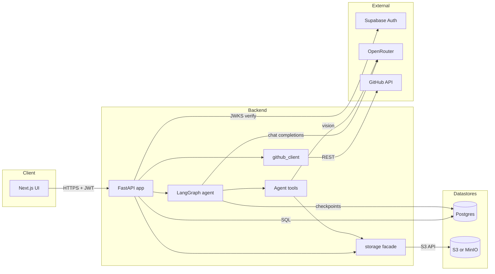

# Architecture

## Overview

A full-stack chat workspace where each project is a LangGraph agent with access to the user's uploaded files. The Next.js UI authenticates with Supabase, talks to a FastAPI backend that owns sessions/threads/messages in Postgres, stores per-project files in S3-compatible object storage (MinIO locally), and runs an LLM agent against OpenRouter. Optional GitHub PAT integration lets the agent read and act on a linked repo.

## Diagram

## Components

- **Next.js UI** — [ui/app/](ui/app/). Auth via [ui/lib/supabase.ts](ui/lib/supabase.ts); `authFetch` attaches the Supabase JWT to every backend call. Dev server proxies `/api/*` to `localhost:8000` ([ui/next.config.mjs](ui/next.config.mjs)).
- **FastAPI app** — [backend/api.py](backend/api.py). Owns `/sessions`, `/threads`, `/files`, `/chat`, `/history`, `/context`, `/github/*`. Verifies every request's JWT via Supabase JWKS, then scopes all DB and storage operations by `user_id`.
- **LangGraph agent** — built in `lifespan()` ([backend/api.py:128](backend/api.py#L128)) with `create_agent`, a `PostgresSaver` checkpointer, and the tool set from `Tools/all_tools`. `thread_id` is scoped as `{user_id}:{session_id}`.
- **Agent tools** — [backend/Tools/](backend/Tools/). File tools (`list_project_files`, `read_project_file`, `write_project_file`) read `user_id` + `session_id` from the runnable config and call the storage facade. `read_project_file` also handles PDF/DOCX/XLSX parsing and routes images to a vision model.
- **Storage facade** — [backend/storage.py](backend/storage.py). `boto3`-backed `S3Bucket` exposing the small `upload/list/download/remove` surface the API and tools depend on; auto-creates the bucket on first use. Configured via `S3_ENDPOINT_URL` / `S3_*` env vars.
- **GitHub client** — [backend/github_client.py](backend/github_client.py). Stores per-user PATs in `github_credentials`, links sessions to a repo via `github_owner/repo/branch` columns on `sessions`, wraps PyGithub calls.
- **Postgres** — schema in [db/init.sql](db/init.sql). LangGraph creates its own checkpoint tables on first startup via `PostgresSaver.setup()`.
- **MinIO** — local S3-compatible store from [docker-compose.yml](docker-compose.yml); console at `http://localhost:9001`. Bucket pre-created by the `minio-init` one-shot container.

## Data flow

**Chat request** (`POST /chat`):

1. UI sends `{ session_id, thread_id, message, attached_files }` with `Authorization: Bearer <jwt>`.
2. API verifies the JWT against Supabase JWKS → `user_id`.
3. `_verify_thread()` confirms the thread belongs to the user.
4. The user's message is persisted to `messages` *before* invoking the agent (so it survives mid-turn crashes).
5. `agent.invoke()` runs with `thread_id = "{user_id}:{session_id}"`; LangGraph reads/writes its checkpoint rows in Postgres.
6. If the agent calls a file tool, the tool resolves `user_id`/`session_id` from config and goes through `storage.py` → S3.
7. All new assistant + tool messages produced by the agent are appended to `messages`.
8. API returns the final assistant reply; the UI polls `/history` to render any intermediate tool messages.

**File upload** (`POST /sessions/{sid}/files`):

1. UI sends multipart upload with JWT.
2. API verifies session ownership, then `storage.get_bucket().upload()` writes each file to key `{user_id}/{session_id}/{filename}` in the `project-files` bucket.

**Project session creation** (`POST /sessions` with `kind: "project"`):

1. Insert `sessions` + default `threads` row.
2. `_seed_project_files()` writes starter `architecture.md` and `report.md` into the session's S3 folder so the agent has files to maintain.

## External dependencies

| Service | Purpose | Configured by |
| --- | --- | --- |
| Supabase Auth | Email/password sign-in; issues JWTs verified server-side via JWKS | `SUPABASE_URL` (backend), `NEXT_PUBLIC_SUPABASE_URL` / `NEXT_PUBLIC_SUPABASE_ANON_KEY` (UI) |
| OpenRouter | Chat completions (`CHAT_MODEL`) and vision (`VISION_MODEL`) | `OPENROUTER_API_KEY` |
| GitHub | Per-user repo browsing / commits via PAT | PAT stored in `github_credentials`, no env var |
| Postgres | All app state + LangGraph checkpoints | `SUPABASE_DB_URL` |
| S3 / MinIO | Per-session file storage | `S3_ENDPOINT_URL`, `S3_ACCESS_KEY`, `S3_SECRET_KEY`, `S3_REGION`, `S3_BUCKET` |

## Data model

| Table | Owns | Notes |
| --- | --- | --- |
| `sessions` | A "project" (group of threads). One row per project. | Holds optional `github_owner/repo/branch` link. |
| `threads` | A conversation inside a session. | FK to `sessions` with `ON DELETE CASCADE`. |
| `messages` | Append-only chat log (user, assistant, tool roles). | Carries `tool_name`, `tool_calls_json`, and per-message `tokens`. |
| `github_credentials` | One PAT per user. | `user_id` is PK — one GitHub identity per app user. |
| LangGraph checkpoint tables | Agent state per `{user_id}:{session_id}` thread. | Created by `PostgresSaver.setup()` on startup; not user-visible. |

User isolation is enforced in Python (`_verify_session`, `_verify_thread`, and the `user_id` prefix on every S3 key). The Supabase deployment additionally enforces RLS; the local Postgres image does not, because the backend connects with full privileges.
