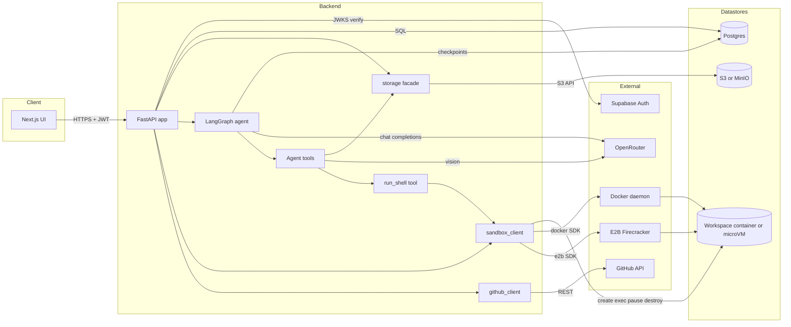

# Architecture

## Overview

A full-stack chat workspace where each project is a LangGraph agent with access to the user's uploaded files **and a sandboxed code workspace**. The Next.js UI authenticates with Supabase, talks to a FastAPI backend that owns sessions/threads/messages and workspace metadata in Postgres, stores per-project loose files in S3-compatible object storage (MinIO locally), and runs an LLM agent against OpenRouter. Project sessions additionally provision a sandboxed workspace — either a local Docker container or an E2B Firecracker microVM, selected by env var — that the agent reaches through the `run_shell` tool. Optional GitHub PAT integration lets the user create or link a real repo, which is auto-cloned into the workspace on first boot.

## Diagram

## Components

- **Next.js UI** — [ui/app/](ui/app/). Auth via [ui/lib/supabase.ts](ui/lib/supabase.ts); `authFetch` attaches the Supabase JWT to every backend call. Dev server proxies `/api/*` to `localhost:8000` ([ui/next.config.mjs](ui/next.config.mjs)). Project-creation modal supports a 3-way GitHub linkage step (none / new repo / link existing) before the session is created.
- **FastAPI app** — [backend/api.py](backend/api.py). Owns `/sessions`, `/threads`, `/files`, `/chat`, `/history`, `/context`, `/workspaces`, `/models`, `/title`, `/github/*` (including `POST /github/repo` for server-side new-repo creation). Verifies every request's JWT via Supabase JWKS, then scopes all DB / storage / sandbox operations by `user_id`. Hosts a background GC loop (5-min cadence) that pauses idle workspaces and destroys expired ones, plus a `_bootstrap_workspace` helper that runs immediately after each new sandbox is created.
- **LangGraph agent** — built in `lifespan()` via `_get_agent(model)` with `create_agent`, a `PostgresSaver` checkpointer, and the tool set from `Tools/all_tools`. `thread_id` is scoped as `{user_id}:{session_id}`. Agents are cached per model so switching models preserves conversation history.
- **Agent tools** — [backend/Tools/](backend/Tools/). File tools (`list_project_files`, `read_project_file`, `write_project_file`) read `user_id` + `session_id` from the runnable config and call the storage facade. `read_project_file` also handles PDF/DOCX/XLSX parsing and routes images to a vision model. **`run_shell`** ([backend/Tools/shell_tool.py](backend/Tools/shell_tool.py)) resolves the session's `workspace_ref` from the same config and exec's inside the sandbox; output is formatted with `(exit N, M ms)` headers and capped at 16 KB per stream.
- **Sandbox client** — [backend/sandbox_client.py](backend/sandbox_client.py). `SandboxBackend` ABC with two implementations: `DockerBackend` (local Docker socket; the `acm-workspace` image from [sandbox/Dockerfile](sandbox/Dockerfile)) and `E2BBackend` (managed Firecracker microVMs). Selected at runtime by `SANDBOX_BACKEND` env var. Exposes `create / exec / read_file / write_file / pause / resume / destroy` and redacts GitHub PATs from all logs.
- **Storage facade** — [backend/storage.py](backend/storage.py). `boto3`-backed `S3Bucket` exposing the small `upload/list/download/remove` surface the API and tools depend on; auto-creates the bucket on first use. Configured via `S3_ENDPOINT_URL` / `S3_*` env vars.
- **GitHub client** — [backend/github_client.py](backend/github_client.py). Stores per-user PATs in `github_credentials`, links sessions to a repo via `github_owner/repo/branch` columns on `sessions`, wraps PyGithub calls. `verify_token_scopes` reads the `X-OAuth-Scopes` response header directly (PyGithub doesn't expose it) so the API can distinguish classic vs fine-grained PATs and refuse fine-grained tokens for repo creation with an actionable error. `create_repo` runs server-side with `auto_init=False` so the workspace pushes the first commit.
- **Postgres** — schema in [db/init.sql](db/init.sql). LangGraph creates its own checkpoint tables on first startup via `PostgresSaver.setup()`. Idempotent in-process migrations in `lifespan()` keep older deployments current.
- **MinIO** — local S3-compatible store from [docker-compose.yml](docker-compose.yml); console at `http://localhost:9001`. Bucket pre-created by the `minio-init` one-shot container.
- **Workspace runtime** — one container or microVM per project session. Holds the cloned repo (or `git init`-ed empty one), runs the agent's shell commands, and survives across chat turns. Lifecycle managed entirely through `sandbox_client`; the API never talks to Docker or E2B directly. Default TTL 24h after last use; idle pause at 15 min; per-user concurrency cap of 3.

## Data flow

**Chat request** (`POST /chat`):

1. UI sends `{ session_id, thread_id, message, attached_files, model }` with `Authorization: Bearer <jwt>`.
2. API verifies the JWT against Supabase JWKS → `user_id`.
3. `_verify_thread()` confirms the thread belongs to the user.
4. If the session is `kind='project'`, `_ensure_workspace_for_session()` returns an existing healthy workspace (auto-resuming if paused) or creates a fresh one + bootstraps it. `workspace_ref` is injected into the agent's runnable config alongside `user_id`/`session_id`.
5. The user's message is persisted to `messages` *before* invoking the agent (so it survives mid-turn crashes).
6. `agent.invoke()` runs with `thread_id = "{user_id}:{session_id}"`; LangGraph reads/writes its checkpoint rows in Postgres.
7. If the agent calls a file tool, the tool resolves `user_id`/`session_id` from config and goes through `storage.py` → S3. If it calls `run_shell`, the tool resolves `workspace_ref` and goes through `sandbox_client` → the container/microVM.
8. All new assistant + tool messages produced by the agent are appended to `messages`.
9. API returns the final assistant reply; the UI polls `/history` to render any intermediate tool messages.

**Workspace bootstrap** (runs once, immediately after `backend.create()`):

1. Look up the session's `github_owner / github_repo / github_branch` + the user's PAT.
2. If linked + PAT present: `git clone --depth 50 <auth_url> /tmp/acm-clone`, move into `/workspace`, then `git remote set-url origin <public_url>` so the token never appears in `git remote -v`. Configure `user.name` / `user.email` via `shlex.quote`d values.
3. If unlinked (or PAT missing): `git init -b main /workspace` + an `--allow-empty 'Initial commit'` so HEAD exists and future rollback can target it.
4. Errors are logged but non-fatal — the agent can re-run setup commands itself.

**File upload** (`POST /sessions/{sid}/files`):

1. UI sends multipart upload with JWT.
2. API verifies session ownership, then `storage.get_bucket().upload()` writes each file to key `{user_id}/{session_id}/{filename}` in the `project-files` bucket.

**Project session creation** (`POST /sessions` with `kind="project"`):

1. If `github_mode` is `new_repo`: verify the PAT has `repo` scope, slugify the name, call `github_client.create_repo()` — fails fast (no session is created on GitHub error).
2. If `github_mode` is `link_existing`: confirm the repo exists and is accessible to the PAT.
3. Insert `sessions` (with `github_owner/repo/branch` populated if linked) + default `threads` row.
4. `_seed_project_files()` writes starter `architecture.md` and `report.md` into the session's S3 folder so the agent has files to maintain.
5. The workspace itself is **not** created here — it lazy-creates on the first `/chat` turn.

**Workspace GC** (background task, 5-min cadence):

1. Destroy workspaces past `expires_at` (default 24h after last use); mark row `destroyed` even if the backend call fails so we don't retry forever on a lost container.
2. Pause `running` workspaces whose `last_used_at` is older than `WORKSPACE_IDLE_PAUSE_MIN` (default 15 min) — frees compute while preserving filesystem state.

## External dependencies

| Service | Purpose | Configured by |
| --- | --- | --- |
| Supabase Auth | Email/password sign-in; issues JWTs verified server-side via JWKS | `SUPABASE_URL` (backend), `NEXT_PUBLIC_SUPABASE_URL` / `NEXT_PUBLIC_SUPABASE_ANON_KEY` (UI) |
| OpenRouter | Chat completions (`CHAT_MODEL`) and vision (`VISION_MODEL`) | `OPENROUTER_API_KEY` |
| GitHub | Per-user repo read/write/create via PAT | PAT stored in `github_credentials` (no env var); UI surfaces a connection modal |
| Postgres | All app state + LangGraph checkpoints | `SUPABASE_DB_URL` |
| S3 / MinIO | Per-session loose-file storage (uploads, seeded docs) | `S3_ENDPOINT_URL`, `S3_ACCESS_KEY`, `S3_SECRET_KEY`, `S3_REGION`, `S3_BUCKET` |
| Docker daemon | Container runtime for the local sandbox backend | `SANDBOX_BACKEND=docker` + host Docker socket |
| E2B | Managed Firecracker microVMs for the production sandbox backend | `SANDBOX_BACKEND=e2b`, `E2B_API_KEY` |

## Data model

| Table | Owns | Notes |
| --- | --- | --- |
| `sessions` | A chat or project session. | `kind` (`chat` / `project`) determines whether a workspace is provisioned. Optional `github_owner / github_repo / github_branch` link. |
| `threads` | A conversation inside a session. | FK to `sessions` with `ON DELETE CASCADE`. |
| `messages` | Append-only chat log (user, assistant, tool roles). | Carries `tool_name`, `tool_calls_json`, per-message token counters (`tokens`, `input_tokens`, `output_tokens`, `thinking_tokens`), and a `langgraph_id` so deletes can target the LangGraph checkpoint too. |
| `workspaces` | One sandboxed container or microVM per session. | `backend` (`docker` / `e2b`) + `backend_ref` (container ID or sandbox ID) identifies the underlying compute; `status` (`running` / `paused` / `destroyed`) drives the GC loop. FK to `sessions` with `ON DELETE CASCADE`. |
| `github_credentials` | One PAT per user. | `user_id` is PK — one GitHub identity per app user. |
| LangGraph checkpoint tables | Agent state per `{user_id}:{session_id}` thread. | Created by `PostgresSaver.setup()` on startup; not user-visible. |

User isolation is enforced in Python (`_verify_session`, `_verify_thread`, and the `user_id` prefix on every S3 key, plus per-user workspace ownership checks). The Supabase deployment additionally enforces RLS; the local Postgres image does not, because the backend connects with full privileges.
